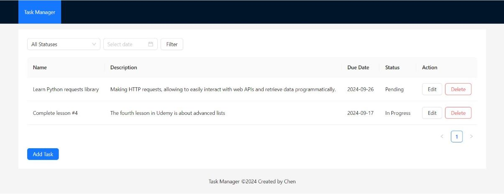

## Overview
This project is a Task Manager that allows users to efficiently manage a list of tasks, including adding, updating, deleting, and filtering tasks.<br />
The solution features a Frontend developed with React using Vite and Ant Design, a Backend powered by Express (Node.js), and a MongoDB database.

## Table of Contents
- [Architecture Diagram](#architecture-diagram)
- [Technologies Used](#technologies-used)
- [Setup Instructions](#setup-instructions)
- [Screenshots](#screenshots)
- [Liked this project?](#liked-this-project)


## Architecture Diagram


## Technologies Used

### Frontend:
-  **React**: JavaScript library for building user interfaces.
-  **Vite**: Fast and opinionated web development build tool.
-  **Ant Design**: UI framework for building elegant interfaces.

### Backend:
-  **Express (Node.js)**: For building the RESTful API.
-  **MongoDB**: NoSQL database for storing tasks.


## Setup Instructions
### Prerequisites
- Node.js installed on your machine
- MongoDB instance

### Frontend Setup
1. Clone the repository:
    ```bash
    git clone https://github.com/chentobiana/task-manager.git
    cd work-management-solution
    ```
2. Install dependencies:
    ```bash
    npm install antd
    npm install
    ```
3. Start the development server:
    ```bash
    npm run dev
    ```

### Backend Setup
1. Install dependencies:
    ```bash
    npm install express mongoose
    ```
2. Start the Express server:
    ```bash
    node server.js
    ```

### MongoDB Setup
1. Connect to your MongoDB instance using the provided connection URL.<br />
The connection URL should be written [here](https://github.com/chentobiana/task-manager/tree/main/backend/.env) 

## Screenshots
### Empty Task list
<br />
### Add a Task
<br />
### List Tasks
<br />


## Liked this project?
- Follow Chen Tobiana in LinkedIn
- Wish Chen good luck with her interview :blush:
